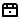

<h1 style="color: rgb(0, 219, 132);">Twitch Bonus Chest Auto Clicker</h1>

This script enables automatic clicking on Twitch bonus chests.

# 🛠️ Usage

Installing Violentmonkey Extension

1. Ensure you have installed the Violentmonkey extension in your browser. If not, you can download it from [this link](https://violentmonkey.github.io/).

## Adding the Script

1. Once Violentmonkey is installed, open it in your browser.
2. Click on the Violentmonkey icon in your browser's toolbar.
3. Select the option to open Violentmonkey's dashboard.
4. Click on the "New script" button to create a new script.
5. Copy and paste the contents of the [script.js](script.js) file into the script editor.
6. Click the "Save" button to save the script.

## Activating the Script

1. After adding the script, reload the Twitch page where you want to use the script.
2. Violentmonkey will automatically run the script, clicking on bonus chests as they appear.

# ⚠️ Caution

This script is provided for educational purposes only. I do not recommend its use, and I do not encourage anyone to violate Twitch's terms of service. Please ensure you comply with Twitch's rules and guidelines when using this script.